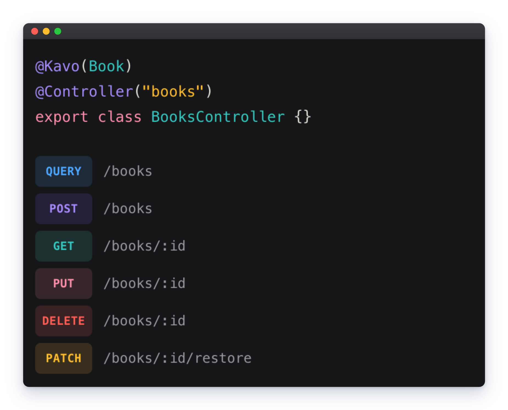

<p align="center">
  
</p>

<h3 align="center">Turn models into APIs.</h3>

<p align="center">
  Define an entity once and get a complete REST and
  GraphQL CRUD API with filtering, sorting, pagination, and generated routes.
</p>

# Kavo

Define an entity once, add one decorator, and Kavo generates the rest: create,
read, update, delete, filtering, sorting, pagination, nested includes, and
field selection — no hand-written controller methods.

[Read documentation](https://kavo.js.org/getting-started)

## Getting started

```bash
pnpm add @kavo/core @kavo/nest @kavo/typeorm
```

```ts
@Kavo(Book)
@Controller("books")
export class BooksController {}
```

That's a full CRUD API. See [kavo.js.org/getting-started](https://kavo.js.org/getting-started)
for the full walkthrough, including NestJS wiring and a soft-delete example.

## Built for agentic development

Built with Claude Code, and shipped with skills so your agent moves just as
fast. [`extensions`](extensions) has nine ready-made skills covering
`@Kavo()`, global config, the query grammar, DTOs, errors, soft delete,
Swagger, and GraphQL — published as a plugin via this repo's own
marketplace:

```
/plugin marketplace add kavo-labs/kavo
/plugin install kavo-skills@kavo-marketplace
```

Fewer tokens, ship faster.

## Packages

| Package                                       | Role                                                        |
| --------------------------------------------- | ----------------------------------------------------------- |
| [`@kavo/core`](packages/core)                 | Contracts, type system, and the request engine              |
| [`@kavo/typeorm`](packages/orms/typeorm)      | TypeORM adapter                                             |
| [`@kavo/prisma`](packages/orms/prisma)        | Prisma adapter                                              |
| [`@kavo/nest`](packages/frameworks/nest)      | NestJS binding — the `@Kavo` decorator and route generation |
| [`@kavo/graphql`](packages/protocols/graphql) | Host-agnostic GraphQL schema binding                        |

Pick the ORM and framework/protocol bindings you need; `@kavo/core` has zero
runtime dependencies.
