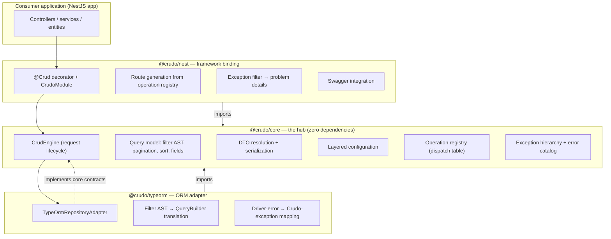
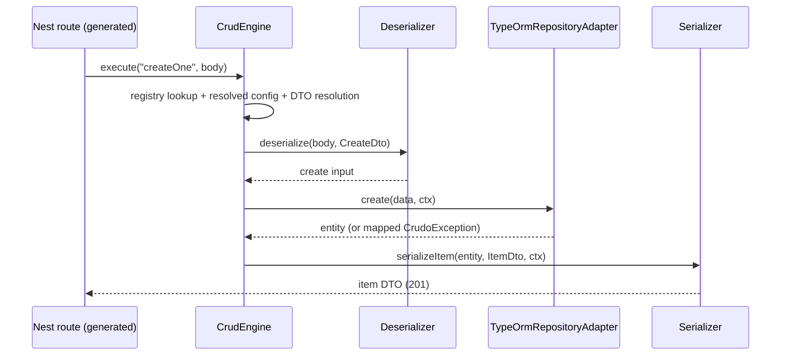
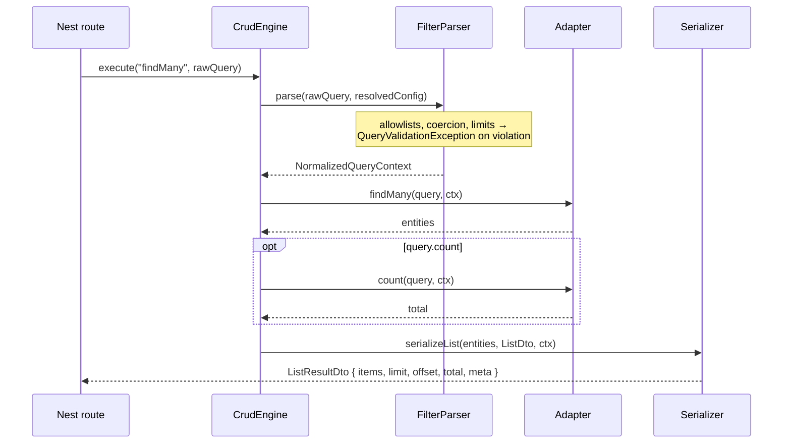
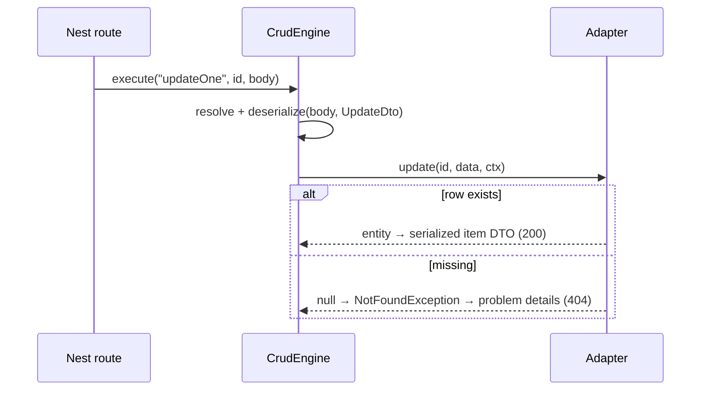

# 01 — System Architecture (Phase 1)

Crudo lets a developer define an entity once (via TypeORM) and get the full
CRUD surface — `createOne` … `purgeOne`, the `*Many` batch variants, and
arbitrary custom operations — with filtering, sorting, pagination, nested
includes, field selection, optional per-operation DTOs, serialization,
transactions, and error handling, configurable at global, entity,
operation, and per-call scope.

v6 scope is deliberately narrow: REST only, three packages
(`@crudo/core`, `@crudo/typeorm`, `@crudo/nest`), no validation subsystem,
no hooks/events, no policy layer, no audit trail.

## 1. Layers and boundaries (C4 level 2)



Both outer packages depend on `@crudo/core`; core depends on nothing. The
adapter reaches the engine only through contracts it implements
(`RepositoryAdapter`), and the framework binding reaches it only through
contracts it consumes (`CrudService`, `OperationRegistry`). This is
strict dependency inversion: core owns every contract; the edges own the
technology.

## 2. Dependency graph (who may import whom)

```
@crudo/nest ──▶ @crudo/core ◀── @crudo/typeorm
     │                                │
     ▼ (peer)                         ▼ (peer)
  @nestjs/*                        typeorm
```

- `@crudo/core` imports **nothing** (ADR-0005).
- `@crudo/typeorm` imports `@crudo/core` + `typeorm` (peer). Never `@crudo/nest`.
- `@crudo/nest` imports `@crudo/core` + `@nestjs/*` (peers). Never
  `@crudo/typeorm` — adapters enter Nest's DI container as providers;
  the binding programs against `RepositoryAdapter` only.
- Cross-package imports go through package barrels; deep imports are not API.

Enforced mechanically by `.dependency-cruiser.cjs` and TS project
references — an illegal import fails CI, not code review.

## 3. Package overview

| Package          | Owns                                                                                                   | Must never depend on         |
| ---------------- | ------------------------------------------------------------------------------------------------------ | ---------------------------- |
| `@crudo/core`    | Contracts, type system, engine, query model, DTO resolution, config merging, exceptions                | anything (zero runtime deps) |
| `@crudo/typeorm` | `RepositoryAdapter`/`TransactionManager`/`FilterBuilder` over TypeORM; error mapping; relation loading | NestJS, `@crudo/nest`        |
| `@crudo/nest`    | `@Crud` decorator, module wiring, route generation, exception filter, Swagger                          | TypeORM, `@crudo/typeorm`    |

ORM independence inside core is a structural discipline even though only
TypeORM is built — it is what keeps the core clean.

## 4. Request lifecycle (first pass — authoritative version in Phase 7)

```
Request
 → Operation Resolution     OperationRegistry lookup
 → Config Resolution        frozen ResolvedEntityConfig (bootstrap-merged)
 → DTO Resolution           explicit DTO, else entity-derived default
 → Deserialization
 → Query Resolution         GET only: query → filter AST (+ IncludeTree, Phase 16 ⟨deferred⟩)
 → Repository Adapter call  transactional once Phase 13 lands ⟨deferred⟩
 → Response Mapping         result → item or ListResultDto envelope
 → Field Selection + Serialization
 → Response
```

Deliberately lean: no validation stage, no hook/event stages, no policy
stage. Cross-cutting behavior lives in the consumer's own controller/
service code around Crudo — the v6 tradeoff, chosen for simplicity. Every
stage boundary is a seam with a plain default in it until its phase lands
— seams, not TODOs — which is what makes Milestone B shippable without
stubbing Milestones C–D as hacks.

## 5. Module responsibilities (inside `@crudo/core`)

| Module           | Responsibility                                                                                               |
| ---------------- | ------------------------------------------------------------------------------------------------------------ |
| `types/`         | `EntityId`, `FieldPath`, shared type utilities                                                               |
| `query/`         | Filter AST, pagination, sort, field selection, lenient + normalized query contexts, parser/builder contracts |
| `dto/`           | The six DTO slots, resolution contract, list + bulk envelopes                                                |
| `errors/`        | `CrudException`, stable error codes, problem-details shape                                                   |
| `config/`        | Settings schema, scope inputs, frozen resolved config                                                        |
| `operations/`    | Operation ids, handler contract, dispatch registry                                                           |
| `relations/`     | Relation descriptors/registry, include tree/resolver (Phase 16 contracts)                                    |
| `context/`       | `CrudContext` + transport-agnostic request/response envelopes                                                |
| `serialization/` | `Serializer` / `Deserializer`                                                                                |
| `persistence/`   | Reader/writer/adapter contracts, transaction manager                                                         |
| `service/`       | `CrudService`, per-call options                                                                              |

## 6. Design patterns, and why

| Pattern                       | Where                                              | Why over the alternative                                                                                                                                                               |
| ----------------------------- | -------------------------------------------------- | -------------------------------------------------------------------------------------------------------------------------------------------------------------------------------------- |
| **Template Method**           | The Phase 7 lifecycle                              | One fixed stage order with swappable stage internals beats a free-form middleware chain: ordering bugs become impossible, and the pipeline stays inspectable.                          |
| **Strategy**                  | Adapters, serializers, pagination, filter builders | Open/Closed: new behavior = new implementation of a core contract, never an engine edit.                                                                                               |
| **Registry (dispatch table)** | `OperationRegistry`                                | One mechanism for built-in, overridden, and custom operations (Phase 14's "one mechanism, several behaviors"); route generation reads the same table, so features get routes for free. |
| **Specification**             | Filter AST                                         | Composable, provider-independent query trees that each adapter translates once, instead of per-ORM query fragments leaking upward.                                                     |
| **Interpreter**               | Adapter filter translation                         | The AST is walked into `QueryBuilder` calls; keeps translation local to the adapter.                                                                                                   |
| **Dependency Injection**      | Everywhere                                         | Core receives its collaborators; only the framework binding knows the container.                                                                                                       |
| **Facade**                    | `CrudService` / `createCrud`                       | One narrow entry point over engine + registry + config machinery.                                                                                                                      |

Rejected: Active Record (couples entities to persistence — kills ORM
independence), event/hook bus (removed from v6 scope; would be a second
mechanism next to the registry), per-ORM query builders in core (breaks
the one-AST discipline).

## 7. Sequence diagrams

### createOne



### findMany



### updateOne



### deleteOne

```mermaid
sequenceDiagram
    participant C as Nest route
    participant E as CrudEngine
    participant A as Adapter
    C->>E: execute("deleteOne", id)
    E->>A: delete(id, ctx)
    Note over A: hard delete in Milestone B;<br/>strategy-resolved (soft) after Phase 15
    A-->>E: void
    E-->>C: 204 No Content
```

## 8. Non-goals (scope-creep insurance)

Crudo is **not**:

- an ORM — it sits on one; it never maps columns or runs migrations;
- a query language beyond the CRUD surface — no aggregations, projections
  beyond sparse fieldsets, or raw-SQL passthrough;
- a GraphQL layer;
- a validation subsystem — DTOs are shapes; teams wire NestJS's own
  `ValidationPipe` if they want validation;
- a policy/authorization layer — `principal` is carried, never judged;
- an event/hook system or audit trail.

## 9. ADR index

| ADR                                                           | Decision                                                  |
| ------------------------------------------------------------- | --------------------------------------------------------- |
| [0001](../adr/0001-clean-architecture-core-owns-contracts.md) | Clean architecture: core owns all contracts               |
| [0002](../adr/0002-package-topology.md)                       | Three packages under `orms/` / `frameworks/` parents      |
| [0003](../adr/0003-pnpm-plain-scripts-tsc-build.md)           | pnpm workspaces, plain scripts, `tsc -b` — no task runner |
| [0004](../adr/0004-lockstep-versioning.md)                    | Lockstep versioning                                       |
| [0005](../adr/0005-core-zero-runtime-dependencies.md)         | Zero runtime dependencies in `@crudo/core`                |
| [0006](../adr/0006-registry-driven-operations.md)             | Registry-driven operation dispatch                        |
| [0007](../adr/0007-module-augmentable-operation-metadata.md)  | Module-augmentable `OperationMetadata`                    |
| [0008](../adr/0008-field-path-recursion-cap.md)               | `FieldPath` recursion cap (default 3, max 5)              |
| [0009](../adr/0009-problem-details-error-shape.md)            | RFC 9457 problem details as the wire error shape          |
| [0010](../adr/0010-explicit-named-barrel.md)                  | Explicit named barrel in core                             |

## 10. Tradeoff analysis

| Choice                                    | Won                                                                                    | Cost accepted                                                                                                                                       |
| ----------------------------------------- | -------------------------------------------------------------------------------------- | --------------------------------------------------------------------------------------------------------------------------------------------------- |
| No hooks/validation/policy stages (v6)    | A lean, comprehensible pipeline; fewer mechanisms to learn                             | Cross-cutting behavior lives in consumer code; teams wanting interception must wrap the service                                                     |
| Contracts complete up front (Phase 3)     | Later phases never mutate core types; adapters/bindings build against a stable surface | Some contracts (relations, bulk) ship before their implementations; risk of design-before-feedback, mitigated by the vertical slices of Milestone C |
| Registry as the single dispatch mechanism | Disable/override/custom and route generation all fall out of one table                 | Even built-ins pay the indirection; slightly more machinery in the minimal path                                                                     |
| AST-based filtering with allowlists       | ORM independence, injection-safe by construction, 400s instead of silent drops         | A parser/translator pair to maintain; wire grammar is a public contract                                                                             |
| Bootstrap-frozen config                   | Zero per-request merge cost; config errors fail fast with entity + key path            | No runtime reconfiguration; anything dynamic must be a per-call parameter                                                                           |
| `limit`/`offset` flat in the envelope     | Request/response symmetry; every consumer needs them                                   | Envelope is less "pure" than an all-meta design; committed — it's normative                                                                         |
| Explicit `{ ctx }` transaction passing    | Visible, typed, testable data flow                                                     | More verbose than ALS ambience; ALS ships later as opt-in convenience only                                                                          |
